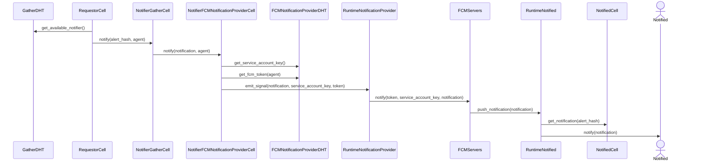

```mermaid
sequenceDiagram

participant GatherDHT
participant RequestorCell
participant NotifierGatherCell
participant NotifierFCMNotificationProviderCell
participant FCMNotificationProviderDHT
participant RuntimeNotificationProvider
participant FCMServers
participant RuntimeNotified
participant NotifiedCell
actor Notified

RequestorCell->>GatherDHT: get_available_notifier()
RequestorCell->>NotifierGatherCell: notify(alert_hash, agent)
NotifierGatherCell->>NotifierFCMNotificationProviderCell: notify(notification, agent)
NotifierFCMNotificationProviderCell->>FCMNotificationProviderDHT: get_service_account_key()
NotifierFCMNotificationProviderCell->>FCMNotificationProviderDHT: get_fcm_token(agent)
NotifierFCMNotificationProviderCell->>RuntimeNotificationProvider: emit_signal(notification, service_account_key, token)
RuntimeNotificationProvider->>FCMServers: notify(token, service_account_key, notification)
FCMServers->>RuntimeNotified: push_notification(notification)
RuntimeNotified->>NotifiedCell: get_notification(alert_hash)
RuntimeNotified->>Notified: notify(notification)
```
